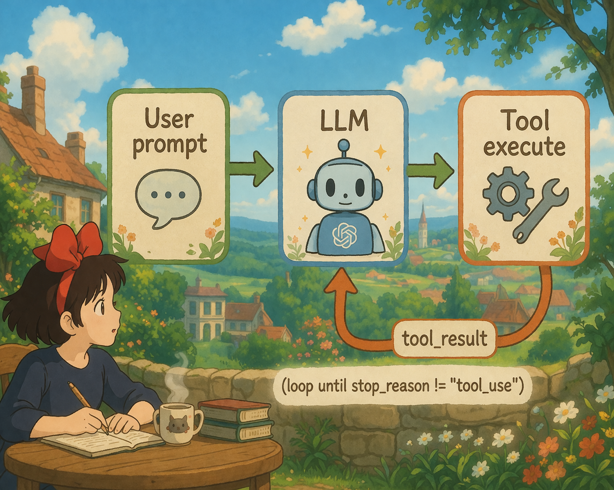

> "One loop & Bash is all you need"-- 一个工具 + 一个循环 = 一个 Agent。



伪代码如下：

```py
while True:
    response = client.messages.create(messages=messages, tools=tools)
    if response.stop_reason != "tool_use":
        break
    for tool_call in response.content:
        result = execute_tool(tool_call.name, tool_call.input)
        messages.append(result)
```

现在理解的 Agent 为：Agent = LLM + tools

-   tools：工具，是文件读写、Shell、网络、数据库、浏览器等，是手脚，去感知获取周遭信息。


<br/>


**变更如下**：

| 组件           | 之前  | 之后                          |
| ------------ | --- | --------------------------- |
| Agent loop   | (无) | `while True` + stop_reason  |
| Tools        | (无) | `bash` (单一工具)               |
| Messages     | (无) | 累积式消息列表                     |
| Control flow | (无) | `stop_reason != "tool_use"`