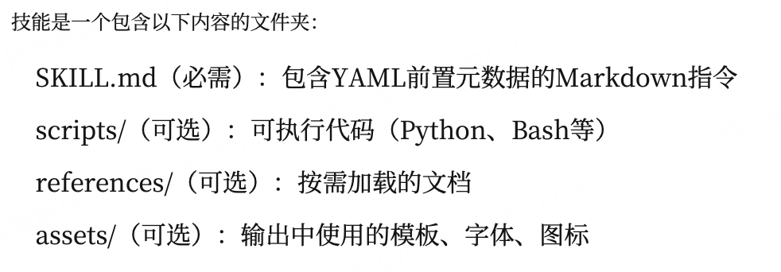
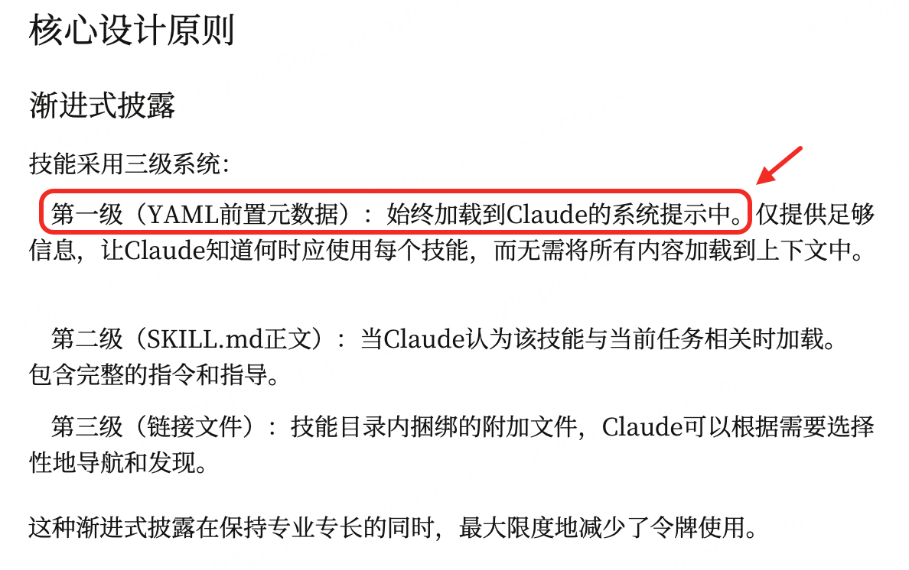

> _"用到什么知识, 临时加载什么知识"_-- 通过 tool_result 注入, 不塞 system prompt。
> 
> **Harness 层**: 按需知识 -- 模型开口要时才给的领域专长。

**问题**：你希望 Agent 遵循特定领域的工作流: git 约定、测试模式、代码审查清单。

全塞进系统提示太浪费 -- 10 个 Skill, 每个 2000 token, 就是 20,000 token, 大部分跟当前任务毫无关系。

```
System prompt (Layer 1 -- always present):
+--------------------------------------+
| You are a coding agent.              |
| Skills available:                    |
|   - git: Git workflow helpers        |  ~100 tokens/skill
|   - test: Testing best practices     |
+--------------------------------------+

When model calls load_skill("git"):
+--------------------------------------+
| tool_result (Layer 2 -- on demand):  |
| <skill name="git">                   |
|   Full git workflow instructions...  |  ~2000 tokens
|   Step 1: ...                        |
| </skill>                             |
+--------------------------------------+
```

**按需加载**：

-   第一层: 系统提示中放 Skill 简介 (低成本)。
-   第二层: tool_result 中按需放完整内容。

**Skill 工作原理**：




1、每个 Skill 是一个目录, 包含`SKILL.md`文件和 YAML frontmatter。

```
skills/
  pdf/
    SKILL.md       # ---\n name: pdf\n description: Process PDF files\n ---\n ...
  code-review/
    SKILL.md       # ---\n name: code-review\n description: Review code\n ---\n ...
```

2、SkillLoader 递归扫描`SKILL.md`文件, 用目录名作为 Skill 标识。

3、第一层写入系统提示。第二层不过是 dispatch map 中的又一个工具。

```py
SYSTEM = f"""You are a coding agent at {WORKDIR}.
Skills available:
{SKILL_LOADER.get_descriptions()}"""

TOOL_HANDLERS = {
    # ...base tools...
    "load_skill": lambda **kw: SKILL_LOADER.get_content(kw["name"]),
}
```

-   第一部分：会加载 header



**问题：skill 越多，那就加载越多，越费 token？**

-   yaml 格式的 header 是一次性加载进去的。
-   所以是的。

<br/>


| 组件    | 之前 (s04)      | 之后 (s05)              |
| ----- | ------------- | --------------------- |
| Tools | 5 (基础 + task) | 5 (基础 + load_skill)   |
| 系统提示  | 静态字符串         | + Skill 描述列表         |
| 知识库   | 无             | skills/*/SKILL.md 文件 |
| 注入方式  | 无             | 两层 (系统提示 + result)