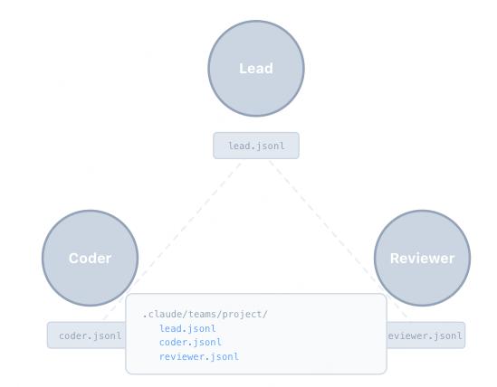

> _"任务太大一个人干不完, 要能分给队友"_-- 持久化队友 + JSONL 邮箱。
> 
> **Harness 层**: 团队邮箱 -- 多个模型, 通过文件协调。

**问题**：Subagent (s04) 是一次性的: 生成、干活、返回摘要、消亡。没有身份, 没有跨调用的记忆。Background Tasks (s08) 能跑 shell 命令, 但做不了 LLM 引导的决策。

**真正的团队协作需要三样东西**:

1.  能跨多轮对话存活的持久 Agent
1.  身份和生命周期管理
1.  Agent 之间的通信通道

```
Teammate lifecycle:
  spawn -> WORKING -> IDLE -> WORKING -> ... -> SHUTDOWN

Communication:
  .team/
    config.json           <- team roster + statuses
    inbox/
      alice.jsonl         <- append-only, drain-on-read
      bob.jsonl
      lead.jsonl

              +--------+    send("alice","bob","...")    +--------+
              | alice  | -----------------------------> |  bob   |
              | loop   |    bob.jsonl << {json_line}    |  loop  |
              +--------+                                +--------+
                   ^                                         |
                   |        BUS.read_inbox("alice")          |
                   +---- alice.jsonl -> read + drain ---------+
```



**工作原理：**

1、TeammateManager 通过 config.json 维护团队名册。

2、`spawn()`创建队友并在线程中启动 agent loop。

3、MessageBus: append-only 的 JSONL 收件箱。`send()`追加一行;`read_inbox()`读取全部并清空。

4、每个队友在每次 LLM 调用前检查收件箱, 将消息注入上下文。