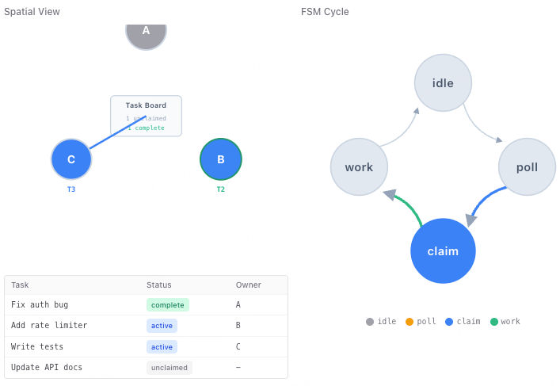

> _"队友自己看看板, 有活就认领"_-- 不需要领导逐个分配, 自组织。
> 
> **Harness 层**: 自治 -- 模型自己找活干, 无需指派。

**问题**：s09-s10 中, 队友只在被明确指派时才动。领导得给每个队友写 prompt, 任务看板上 10 个未认领的任务得手动分配。这扩展不了。

一个细节: Context Compact (s06) 后 Agent 可能忘了自己是谁。身份重注入解决这个问题。

**解决**：真正的自治: 队友自己扫描任务看板, 认领没人做的任务, 做完再找下一个。

```
Teammate lifecycle with idle cycle:

+-------+
| spawn |
+---+---+
    |
    v
+-------+   tool_use     +-------+
| WORK  | <------------- |  LLM  |
+---+---+                +-------+
    |
    | stop_reason != tool_use (or idle tool called)
    v
+--------+
|  IDLE  |  poll every 5s for up to 60s
+---+----+
    |
    +---> check inbox --> message? ----------> WORK
    |
    +---> scan .tasks/ --> unclaimed? -------> claim -> WORK
    |
    +---> 60s timeout ----------------------> SHUTDOWN

Identity re-injection after compression:
  if len(messages) <= 3:
    messages.insert(0, identity_block)
```



**工作原理：**

1、队友循环分两个阶段: WORK 和 IDLE。LLM 停止调用工具 (或调用了`idle`) 时, 进入 IDLE。

2、空闲阶段循环轮询收件箱和任务看板。

3、任务看板扫描: 找 pending 状态、无 owner、未被阻塞的任务。

4、身份重注入: 上下文过短 (说明发生了压缩) 时, 在开头插入身份块。

<br/>

| 组件    | 之前 (s10) | 之后 (s11)                |
| ----- | -------- | ----------------------- |
| Tools | 12       | 14 (+idle, +claim_task) |
| 自治性   | 领导指派     | 自组织                     |
| 空闲阶段  | 无        | 轮询收件箱 + 任务看板            |
| 任务认领  | 仅手动      | 自动认领未分配任务               |
| 身份    | 系统提示     | + 压缩后重注入               |
| 超时    | 无        | 60 秒空闲 -> 自动关机